**需要完整代码可以加qq  931708230 或者加微信 ynwwxid**

**需要完整代码可以加qq  931708230 或者加微信  ynwwxid**

#民宿预定管理系统 #java web #java #毕业设计 #springboot #课程设计 #编程 #vue #mybatisPlus #源代码 

## 基于SpringBoot+vue的民宿预定管理系统

## 一、系统介绍

前台：
- 民宿预定、我的预定。       
- 民宿周边美食、民宿周边美景。      
- 民宿交流。
- 登录、注册、修改密码

后台管理：
- 民宿管理
- 民宿周边美食管理、民宿周边美景管理
- 订单管理
- 用户管理

## 二、所用技术

### 后端
* 核心框架：SpringBoot
* 持久层框架：MyBatisPlus
* 权限框架：SpringSecurity

### 前端
vue

## 三、环境介绍

基础环境 :IDEA/eclipse, maven3.x, JDK 1.8 , Mysql, Node.js

源码+数据库脚本 

所有项目以及源代码本人均调试运行无问题 可支持远程调试运行

## 四、页面截图

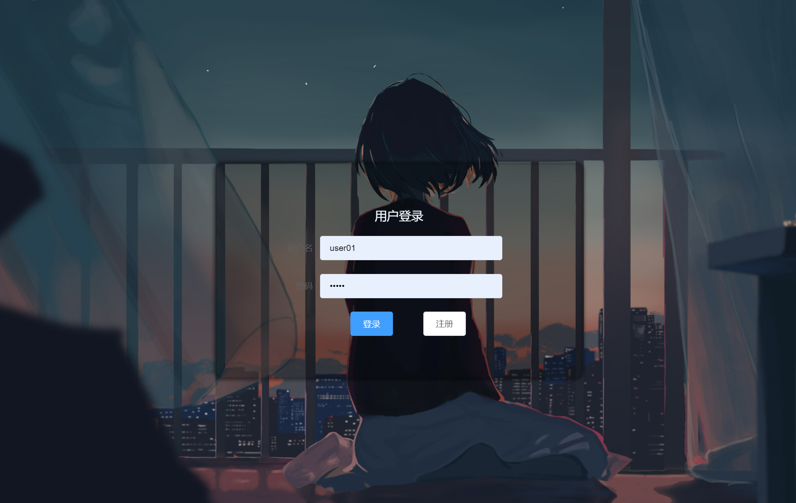

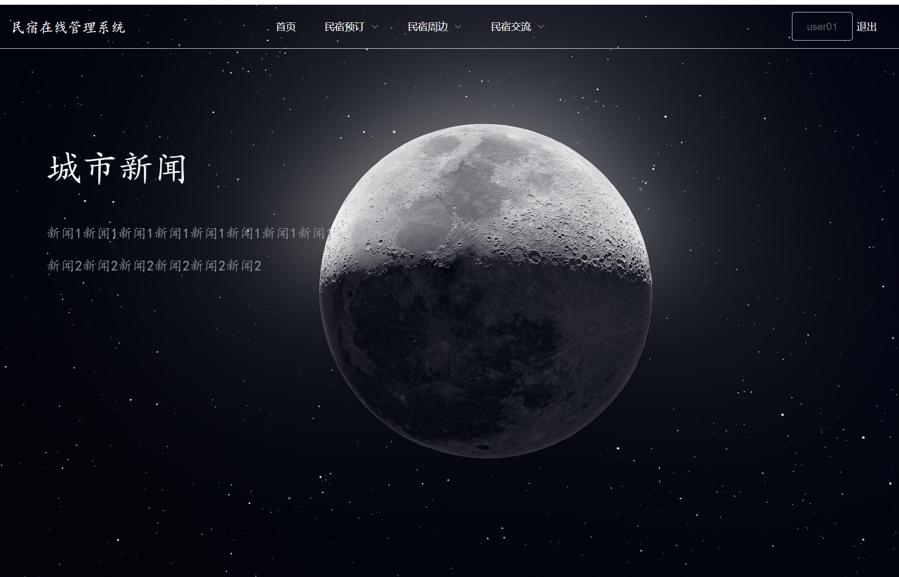

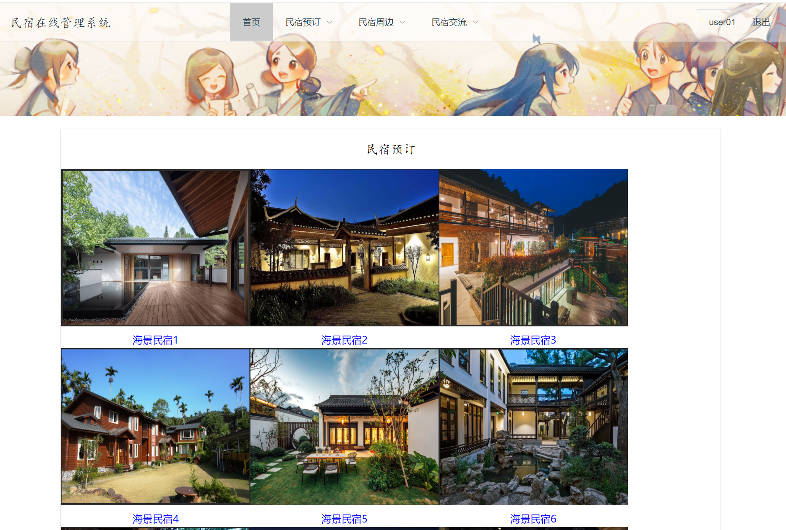

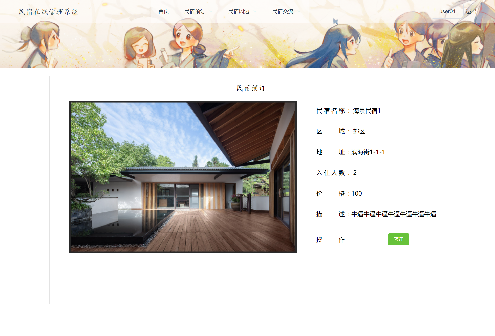

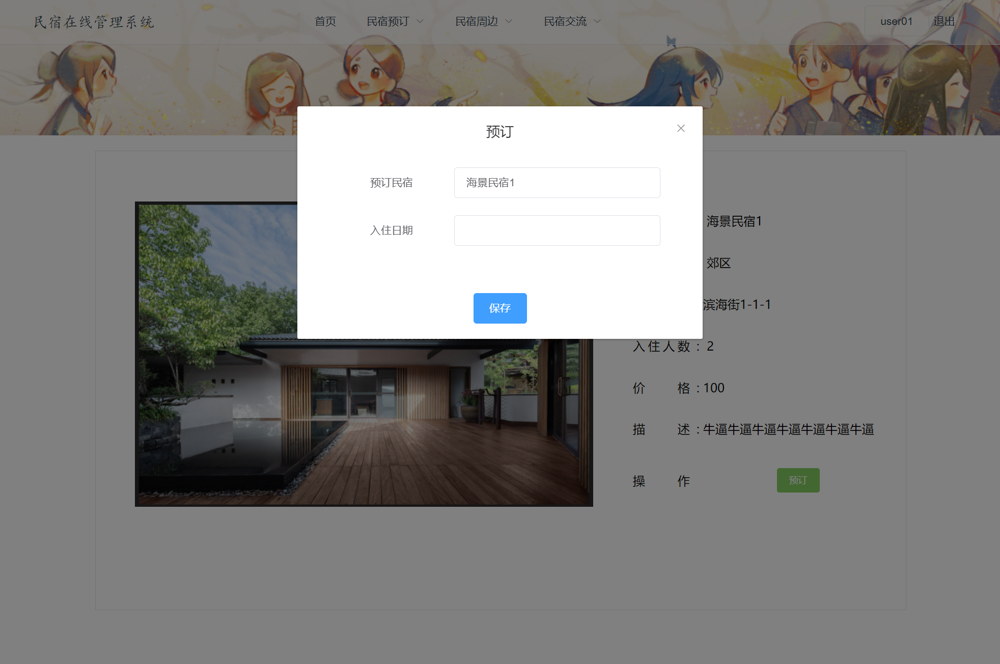

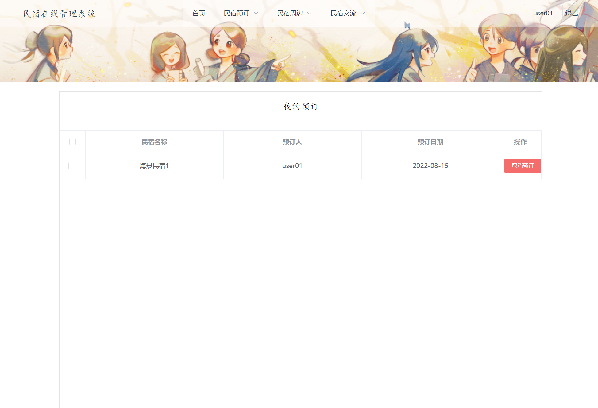

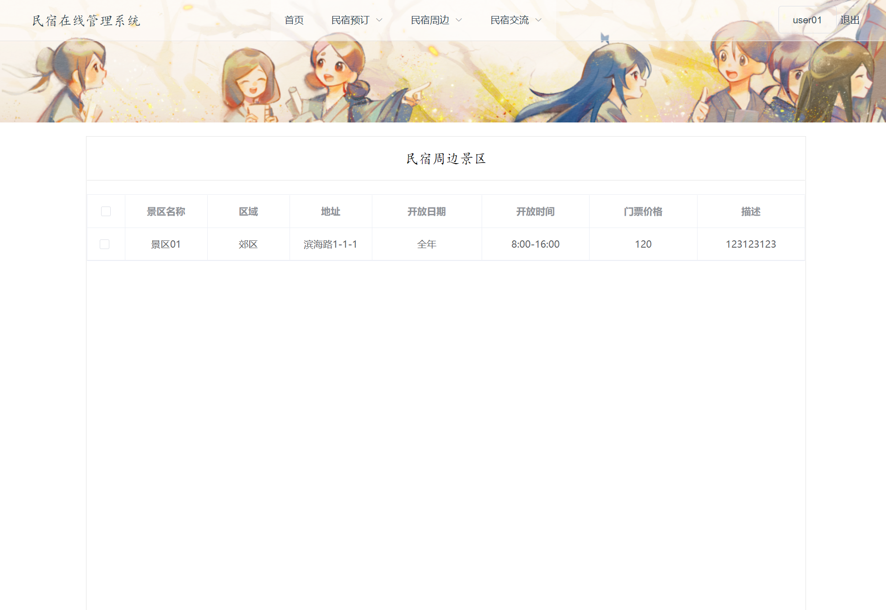

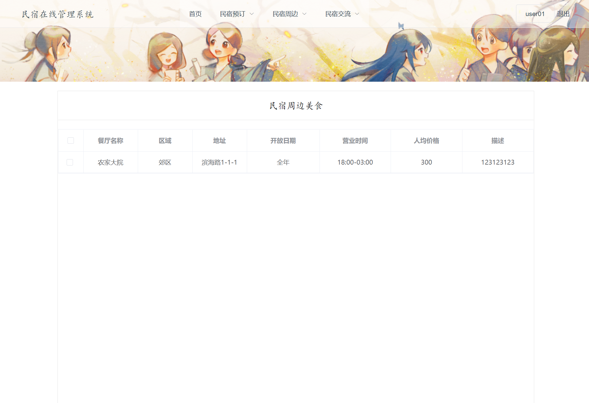

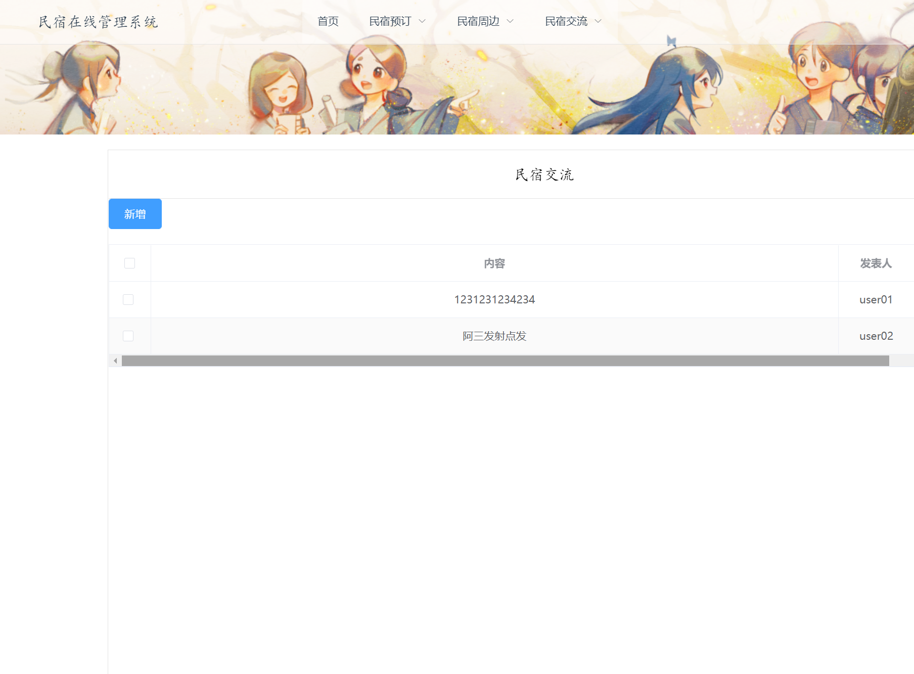

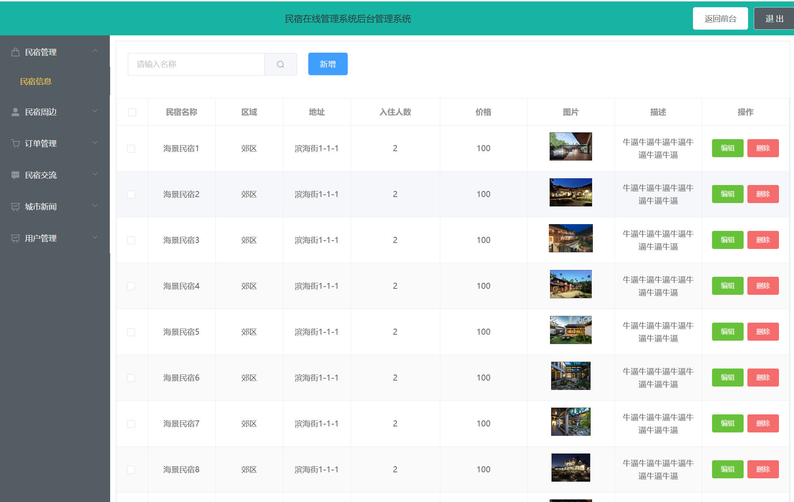

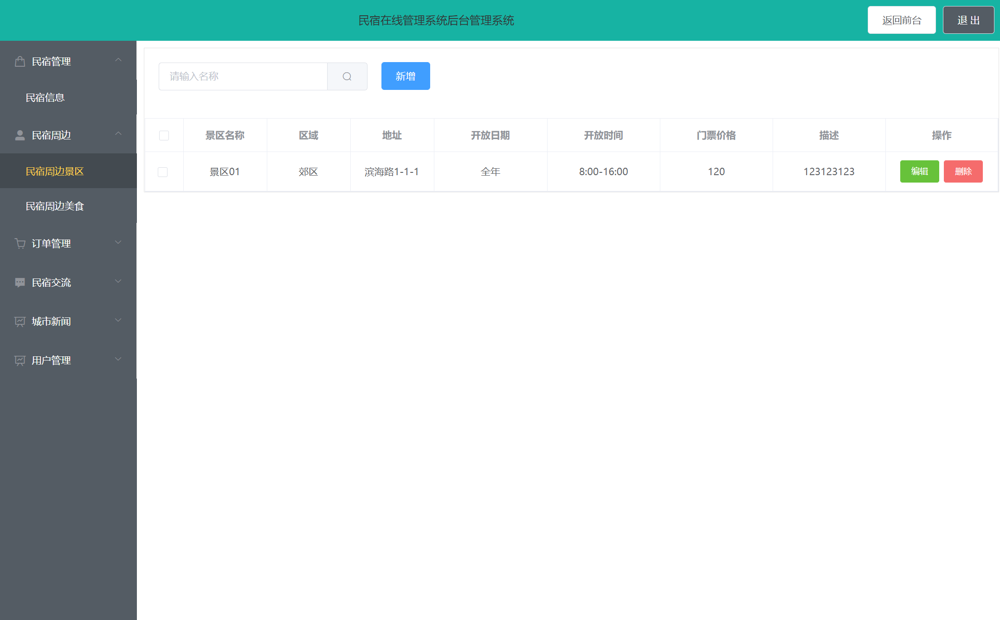

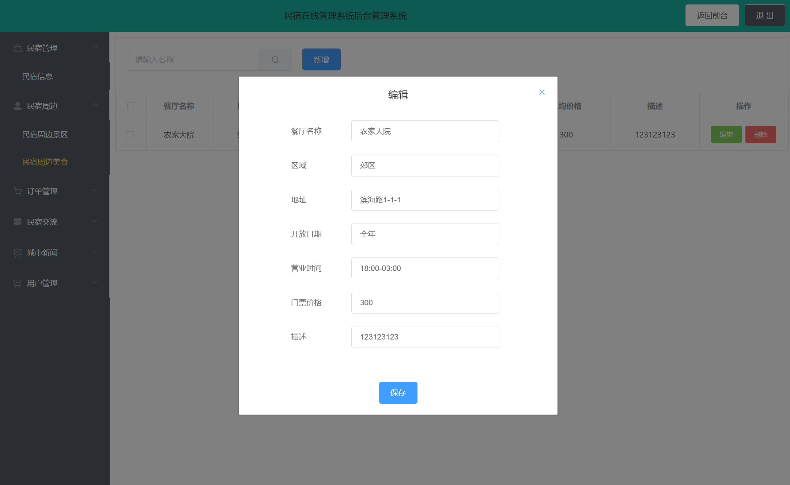

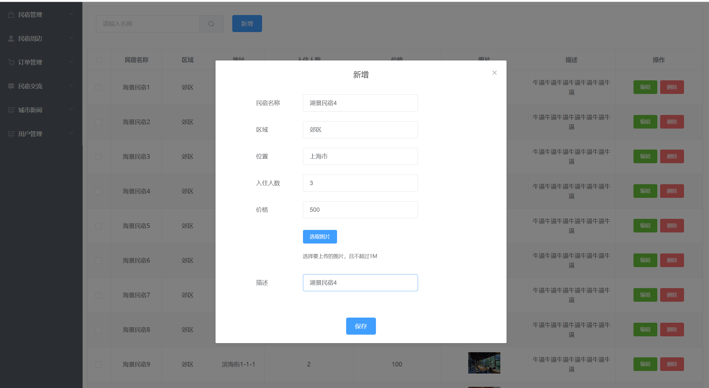

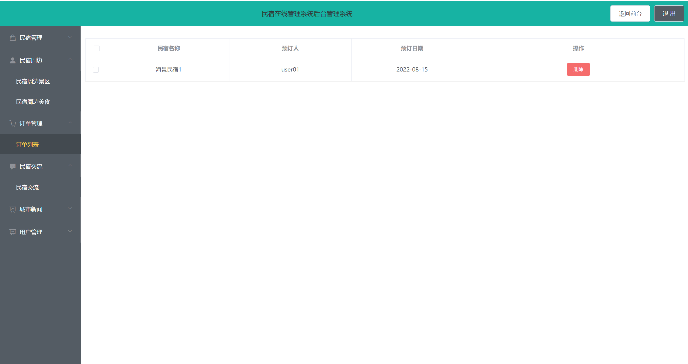

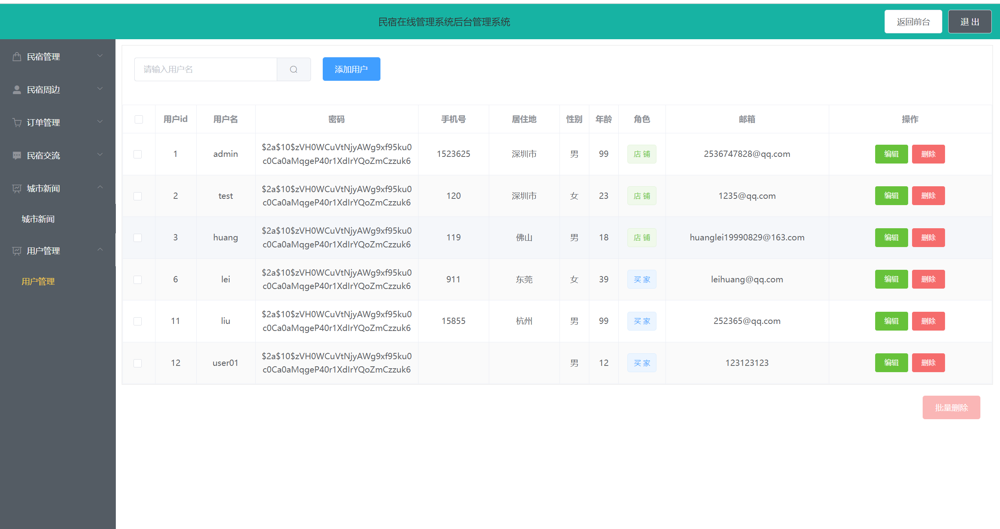

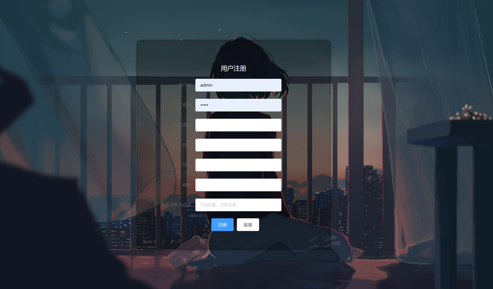

## 五、浏览地址

前端访问地址：http://localhost:8080/   用户名：user01 密码：admin

后台访问地址：http://localhost:8080/bcakstage 用户名：admin 密码：admin

## 六、安装教程

下载源码，执行sql文件，然后修改application-dev.yml文件中连接数据库的用户名、密码。运行项目即可。

**需要完整代码可以加qq  931708230 或者加微信 ynwwxid**

**需要完整代码可以加qq  931708230 或者加微信  ynwwxid**

